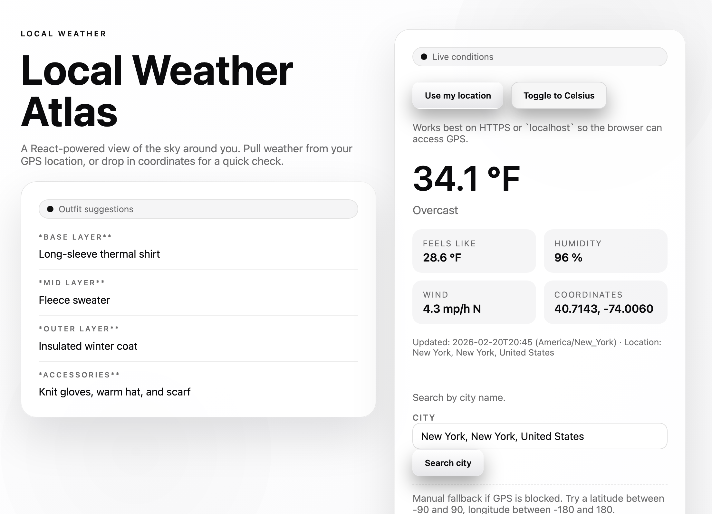

# Local Weather Atlas

React single-page weather app with GPS-based lookup and AI outfit suggestions.



Website: `https://weather-api-72g0.onrender.com/`

## Features

- Current conditions from Open-Meteo (no API key required).
- Browser geolocation, city search, or manual coordinates.
- Outfit suggestions generated by OpenAI based on live weather.
- Apple‑style light UI theme.

## Requirements

- Node.js 18+ (for `server.js`)
- An OpenAI API key

## Setup

Create a `.env` file (or copy `.env.example`) and add your key:

```
OPEN_AI_KEY=your-key-here
APP_ENV=development
# Optional: overrides APP_ENV
API_BASE=http://localhost:8989
```

## Run

Start the local server (serves the site + `/api/suggest`):

```bash
node server.js
```

Open:

```
http://localhost:5173
```

## Project Structure

- `index.html` — page shell and React entry
- `styles.css` — theme + layout styles
- `app.js` — UI + weather fetch + suggestion rendering
- `server.js` — static server + OpenAI proxy endpoint

## API Flow

1. Client fetches weather from Open-Meteo.
2. Client posts a weather summary to `POST /api/suggest`.
3. Server calls OpenAI Responses API and returns formatted outfit advice.

## Notes

- Geolocation requires HTTPS or `localhost`.
- Keep the API key server-side; do not expose it in browser code.
- If you see `Not found` errors, ensure you are running `node server.js` (not a static server).
